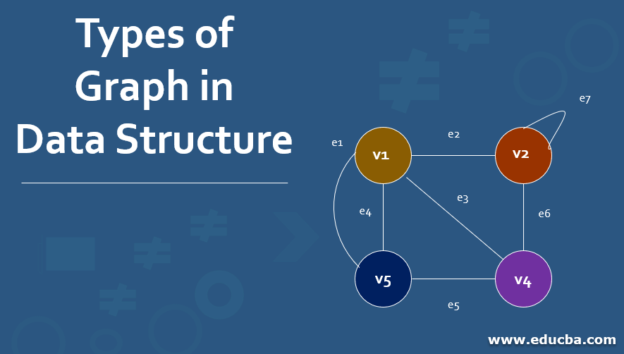

# Graphs

## Terminology

- **Graph:** *non-linear data structure that can be looked at as a collection of vertices (or nodes) potentially connected by line segments named edges.*
- **Vertex:** *also called a “node”, is a data object that can have zero or more adjacent vertices.*
- **Edge:** *connection between two nodes.*
- **Neighbor:** *neighbors of a node are its adjacent nodes (connected via an edge).*
- **Degree:** *degree of a vertex is the number of edges connected to that vertex.*

## Directed vs Undirected

- **Undirected graph:** *graph where each edge is undirected or bi-directional.*
- **Directed graph:** *also called a digraph is a graph where every edge is directed.*

## Complete vs Connected vs Disconnected
- **Complete graph:** *when all nodes are connected to all other nodes.*
- **Connected graph:** *graph that has all of vertices/nodes have at least one edge.*
- **Disconnected graph:** *graph where some vertices may not have edges.*

## Acyclic vs Cyclic
- **Acyclic:** *directed graph without cycles*
    - **Cycle:** *when a node can be traversed through and potentially end up back at itself*
- **Directed acyclic graph (DAG):** *can also be represented as what we know as a tree.*
- **Cyclic:** *graph that has cycles*
    - **Cycle:** *defined as a path of a positive length that starts and ends at the same vertex.*

## Weighted Graphs

- **Weighted graph:** *graph with numbers assigned to its edges, the numbers are called weights.*
- **When representing a weighted graph in a matrix, you set the element in the 2D array to represent the actual weight between the two paths.**

## Real World Uses of Graphs

- *GPS and Mapping.*
- *Driving Directions.*
- *Social Networks.*
- *Airline Traffic.*
- *Netfix uses graphs for suggestions of products.*